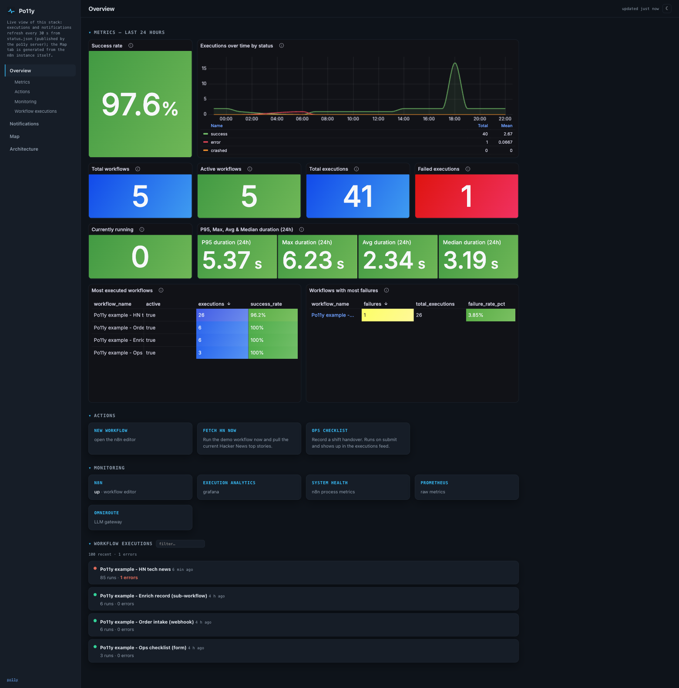
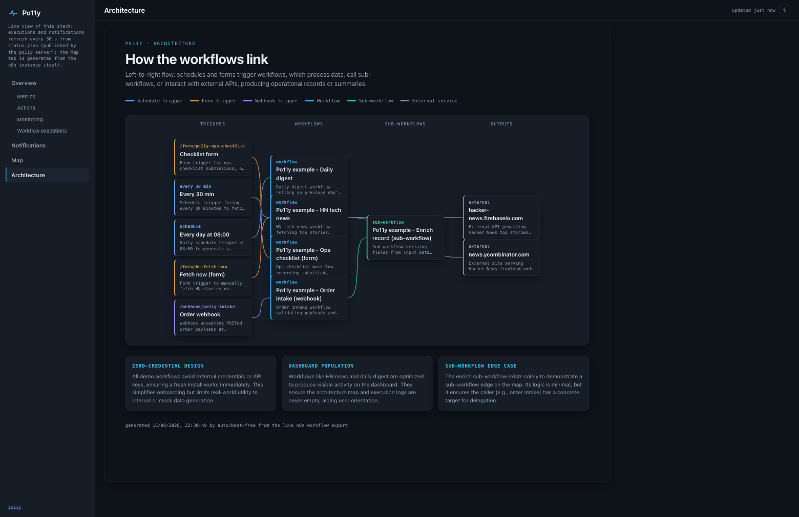
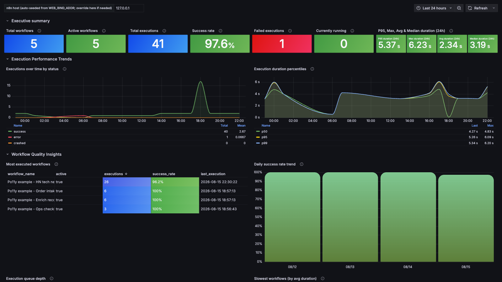
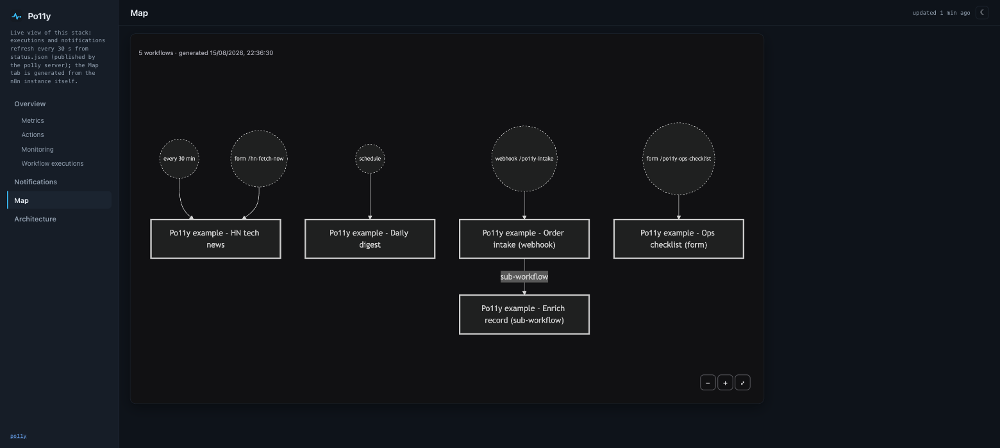

[](https://github.com/labrise-consulting/po11y/actions/workflows/ci.yml)
[](https://github.com/labrise-consulting/po11y/actions/workflows/ci.yml)
[](LICENSE)
[](https://github.com/labrise-consulting/po11y/releases)

Po11y is an open-source, self-hosted status dashboard and observability stack for [n8n](https://n8n.io), the workflow automation tool. It shows running workflows, system health, and inter-workflow dependencies, refreshed on a poll interval you set.

There is no build step: the dashboard is static files on Nginx, with one `server` process behind it and Grafana for metrics. n8n needs no po11y workflows installed.

The read-only topology changes nothing about the n8n you already run.

## Quickstart: Bundled (with n8n)

The default path. Po11y installs and manages its own n8n. To monitor an n8n you already run, see [Quickstart: Read-only](#quickstart-read-only-against-an-existing-n8n).

### Prerequisites

Docker Engine with the Compose v2 plugin, and `python3`. `bootstrap.sh` checks
for both and stops if either is missing. Ports `8080` and `5678` must be free on
the address you bind to.

### Setup

```sh
git clone https://github.com/labrise-consulting/po11y && cd po11y
./bootstrap.sh                # Full stack: n8n, Postgres, Prometheus, Grafana, Dashboard
./bootstrap.sh --no-examples  # Skip the demo workflows
```

Access services at:
- **Dashboard**: `http://127.0.0.1:8080`
- **n8n Editor**: `http://127.0.0.1:5678` (credentials generated in `.env`)

By default, services bind to `127.0.0.1`. To expose services on a local network or VPN, set `BIND_ADDR` and `DASHBOARD_BASIC_AUTH` in `.env`. See [docs/security.md](docs/security.md).

## Core Features

https://github.com/user-attachments/assets/0e77f4f9-4119-41e7-a59b-c20b56d2afc5

The video walks the whole stack end to end.

### Dashboard Views

- **Overview**: Displays active trigger buttons, service monitoring links, an execution summary, notification feeds, and embedded Grafana panels.

  

- **Architecture Map** (the **Architecture** tab): Displays an interactive map of your workflows, updated automatically every 10 minutes. Relationships are calculated deterministically; the per-workflow descriptions are LLM-generated by default (see [docs/ai-map.md](docs/ai-map.md) to keep them local).

  

- **Grafana Dashboards**: Includes prewired dashboards for n8n execution analytics, system resource usage, webhooks, and forms.

  

- **Interactive Workflow Map** (the **Map** tab): Pan and zoomable workflow diagram with dark/light mode toggles and custom sidebar pages. Edges follow real references, so a sub-workflow call shows up as a labelled edge rather than a guess.

  

- **Alerting Options**: The server's own watchdog runs by default in every deployment. The bundled stack also ships pre-configured Grafana alert rules against n8n's database, and any deployment can add an optional Prometheus + Alertmanager overlay. See [docs/alerting.md](docs/alerting.md).

- **MCP Server**: Includes a read-only Model Context Protocol server at `/mcp/` for AI assistant integration. See [docs/mcp.md](docs/mcp.md).

- **Bundled LLM gateway**: `bootstrap.sh` includes an [OmniRoute](https://github.com/diegosouzapw/OmniRoute) gateway by default, exposing one OpenAI-compatible endpoint with provider routing and fallback. Po11y uses it for architecture map descriptions, but it is a general gateway: connect your providers once at `http://127.0.0.1:20128`, then point n8n AI nodes at `http://omniroute:20128/v1` and host tools such as VS Code at `http://127.0.0.1:20128/v1`. It binds to loopback only and its proxy takes no API key by default, so keep it off shared networks. See [docs/ai-map.md](docs/ai-map.md#using-omniroute-beyond-the-map).

On a stack brought up by `bootstrap.sh`, the AI architecture map sends workflow digests through OmniRoute's `auto/best-free` route by default, which forwards them to whichever free-tier provider it picks, using none of your own API keys. Set `OMNIROUTE_ENABLED=false` for local heuristic descriptions, or point `AI_MAP_BASE_URL` at a local model. The read-only topology does not run `bootstrap.sh` and sends nothing to an LLM until you configure one. See [docs/ai-map.md](docs/ai-map.md).

## Deployment Topologies

Po11y runs one process, `server`, in every deployment. It polls n8n into a
SQLite store and serves the dashboard's five feeds, the MCP endpoint (`/mcp/`),
the data-table read proxy (`/n8n-table/`), `/metrics`, and the alert push
(`ALERT_WEBHOOK_URL`) and heartbeat (`ALERT_HEARTBEAT_URL`). It is not
optional: stopping it takes all of those down. See
[docs/server.md](docs/server.md).

Three guarantees hold in **both** topologies, because they are properties of
that server rather than of how it is deployed: it issues **GET requests only**
to n8n, it never needs the **Docker socket**, and it leaves the **Execute
Command node disabled**. Two compose files then start that same server against
different n8n instances:

| | Bundled (`docker-compose.yml`) | Read-only (`docker-compose.readonly.yml`) |
|---|---|---|
| n8n instance | Installed and managed by Po11y | Your existing one, unchanged |
| Setup | `./bootstrap.sh` | Four environment variables, then `docker compose -f docker-compose.readonly.yml up -d` |
| User access | Single shared owner login | Your existing n8n logins |
| Best for | Homelabs, single users, new setups | Existing deployments, production teams |

### Container Images

The `server` process is published to GHCR on every `v*` tag, after every other
CI job passes:

```
ghcr.io/labrise-consulting/po11y/server:<tag>    # immutable
ghcr.io/labrise-consulting/po11y/server:latest   # moving alias
```

Only po11y's own code is published. The bundled topology still needs this
repository, because `bootstrap.sh` drives it and the root `Dockerfile` derives
from n8n's image, which carries the Sustainable Use License. See
[docs/ci.md](docs/ci.md).

### Project Status

Both topologies work, but they do not have equal mileage.

| | Bundled | Read-only |
|---|---|---|
| CI coverage | End-to-end smoke test: `bootstrap.sh`, live assertions against the running stack, then a repeat run to check idempotency | Server unit tests, including a GET-only invariant test, plus Compose config validation. No end-to-end bring-up |
| Real-world use | The path Po11y is developed against day to day | Fewer instances, and more varied ones |

Rough edges are likelier on the read-only topology. Please [open an issue](https://github.com/labrise-consulting/po11y/issues) if you hit one.

## Bundled Stack: Demo Workflows and Packs

The dashboard's own feeds (map, forms, status, `/metrics`) come from the
`server` process, not from n8n workflows. Bootstrap installs five optional demo
workflows (skip them with `--no-examples`). They need no credentials, and only
the first one makes an outbound call:

| Workflow | Trigger | Description |
|---|---|---|
| Po11y example - HN tech news | Schedule (30 min) + form | Fetches Hacker News top stories, so a fresh install has real executions to look at. |
| Po11y example - Order intake (webhook) | `POST /webhook/po11y-intake` | Accepts an order and hands it to the sub-workflow below. Gives the map a webhook trigger and a real sub-workflow edge. |
| Po11y example - Enrich record (sub-workflow) | Called by another workflow | Derives a few fields from whatever the caller sent. Fills the map's sub-workflow column. |
| Po11y example - Ops checklist (form) | Form | Records a shift handover. A second Actions button, with real form fields. |
| Po11y example - Daily digest | Schedule (daily 08:00) | Rolls the previous day into one summary item. A second schedule cadence next to the 30-minute one. |

Together they give a fresh install something to show on every view: five
triggers of four kinds, a sub-workflow call, and two external services on the
architecture map.

### Demo Heartbeat (opt-in)

All five examples above finish in a few seconds, so the live-run indicator has
nothing to show unless a poll happens to land inside a run. `workflows/demo/`
holds one more workflow that solves this, kept out of the default import
because it runs 1440 times a day:

```sh
./bootstrap.sh --pack /workflows/demo    # Po11y demo - Heartbeat
```

It runs every minute and holds the execution open for 20 seconds, so roughly
one third of the time a workflow is genuinely in flight. Use it to see the cyan
"N running" pill, `po11y_workflow_running_seconds` counting up, and the
watchdog's `stuck` rule with real input. Pair it with a short poll:

```sh
SERVER_POLL_INTERVAL=5   # in .env
"refreshSec": 5          # in config.json
```

Waits shorter than 65 seconds keep the execution in memory, so n8n reports it
as `running`. A longer wait becomes `waiting`, which Po11y does not count.

### Importing Existing Workflows

Import workflow JSON directories using:

```sh
./bootstrap.sh --pack https://github.com/you/your-workflows
./bootstrap.sh --pack ./my-local-dir
```

A path starting with `/workflows/` or `/packs/` is read inside the container,
which is how the heartbeat pack above is imported. Any other path is a
directory on your machine, and is copied into `packs/` first so the container
can see it.

## Quickstart: Read-only (against an existing n8n)

This topology monitors an external n8n instance without altering its configuration.

### No LLM by default

This topology sends nothing to an LLM unless you configure one. The bundled
OmniRoute gateway is wired up by `bootstrap.sh`, which the commands below do
not run, so the architecture map uses local heuristic descriptions. To enable
LLM prose, start the gateway overlay and set the three `AI_MAP_*` variables in
`.env` — the map calls an LLM only when all three are set. See
[docs/ai-map.md](docs/ai-map.md).

### Prerequisites

1. An n8n API key with read permissions (`workflow:list`, `workflow:read`, `execution:list`, `execution:read`).
2. (Optional) Set `N8N_METRICS=true` on the remote n8n instance to enable Prometheus metric scraping. See [docs/security.md](docs/security.md#upstream-n8n_metrics-considerations).

### Setup Commands

```sh
git clone https://github.com/labrise-consulting/po11y && cd po11y
cp .env.example .env                         # Configure N8N_API_URL, N8N_API_KEY, N8N_METRICS_TARGET, GRAFANA_ADMIN_PASSWORD
cp config.readonly.example.json config.json   # Read-only configuration template
docker compose -f docker-compose.readonly.yml up -d
```

### Key Environment Variables

| Variable | Required | Description |
|---|---|---|
| `N8N_API_URL` | Yes | Base URL of target n8n instance — where po11y sends requests |
| `N8N_API_KEY` | Yes | Read-only API key |
| `N8N_PUBLIC_URL` | No | Base URL a reader opens, used for links in tool results and alerts (default: `N8N_API_URL`) |
| `N8N_METRICS_TARGET` | Yes | `host:port` for n8n `/metrics` endpoint |
| `GRAFANA_ADMIN_PASSWORD` | Yes | Grafana admin password |
| `SERVER_POLL_INTERVAL` | No | Server poll interval in seconds (default: `30`) |
| `EXECUTIONS_LIMIT` | No | Recent execution window size (default: `250`, which is n8n's maximum) |

The poll interval sets how fresh the dashboard is, and it also sets what the
dashboard can see at all. Po11y knows a workflow is running only if a poll
occurs while the workflow runs. Workflows that complete in less time than
`SERVER_POLL_INTERVAL` can start and finish between two polls. Po11y then
records the run, but never shows it as running, and the watchdog cannot report
it as stuck. Decrease `SERVER_POLL_INTERVAL` if your workflows are short and you
want to see them run. Each decrease adds two more n8n API requests per interval,
one for the finished executions and one for the running executions. Also make
sure that `EXECUTIONS_LIMIT` stays larger than the number of executions that
complete in one interval. The default is already n8n's maximum, so an instance
that completes more than 250 executions per interval must decrease
`SERVER_POLL_INTERVAL`.

## Feature Comparison

Scope: self-hosted, open-source projects that watch an existing n8n. Hosted
services are not compared here.

| Project | Approach | License | How it reads n8n | Alerting | Per-node detail | Workflow map |
|---|---|---|---|---|---|---|
| **Po11y** | Status page, workflow maps, Grafana, MCP | MIT | Read-only REST API, GET-only; the bundled topology also installs and manages the instance | Watchdog + webhook always<br>5 Grafana rules in the bundled topology | No | **Yes** |
| **[n8nTrace](https://github.com/Mohammedaljer/n8nTrace)** | Analytics dashboard | MIT | Collector workflows you import, which push into its own Postgres | Not documented | **Yes**, node-level metrics | No |
| **[n8n-toolkit](https://github.com/thenguyenvn90/n8n-toolkit)** (`n8n_manager.sh`) | Install-and-operate CLI | MIT | Installs and manages the instance, then provisions Prometheus + Grafana | Pre-provisioned Grafana alert rules | No | No |
| **[n8n-observability](https://github.com/thenguyenvn90/n8n-observability)** | Prometheus + Grafana stack | MIT | Scrapes n8n `/metrics` (`N8N_METRICS=true`) plus host and database exporters | Example queries, you write the rules | No | No |
| **DIY error workflows** | A pattern rather than a project | N/A | Error-trigger workflows you install yourself | Failure notifications only | Error payload only | No |

Compiled in August 2026 from each project's public documentation. Corrections
are welcome: if a row is wrong or has gone out of date, please
[open an issue](https://github.com/labrise-consulting/po11y/issues) and it will
be fixed.

## Documentation

- [docs/alerting.md](docs/alerting.md): Alerting mechanisms, configuration, and webhooks.
- [docs/security.md](docs/security.md): Security architecture and authorization details.
- [docs/forward-auth.md](docs/forward-auth.md): OIDC single sign-on overlay guide.
- [docs/configuration.md](docs/configuration.md): `config.json` specifications and JSON feed contracts.
- [docs/mcp.md](docs/mcp.md): Model Context Protocol (MCP) server configuration.
- [docs/ai-map.md](docs/ai-map.md): AI architecture map configuration options.
- [docs/integration.md](docs/integration.md): Integrating Po11y into existing Compose stacks.
- [docs/deployment.md](docs/deployment.md): Podman, Kubernetes, and OpenTelemetry setup guides.
- [docs/server.md](docs/server.md): po11y's architecture — the `server` process, its environment, multi-scope deployments, backup.
- [docs/ci.md](docs/ci.md): The CI pipeline and the published container images.

## Contributing

Pull requests and issue reports are welcome. See [CONTRIBUTING.md](CONTRIBUTING.md) for local testing instructions. Please report security issues according to [SECURITY.md](SECURITY.md).

## About

Built and maintained by **[Labrise Consulting](https://labrise-consulting.com)**.

Released under the [MIT License](LICENSE). Vendored dependencies in [`html/vendor/`](html/vendor/README.md) retain their respective open-source licenses.
