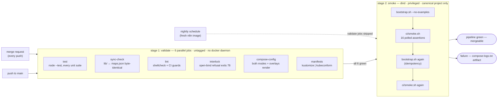

# CI pipeline

The CI pipeline runs in two stages: six validate jobs that run on standard runners, followed by one smoke job that boots the complete Mode A stack using Docker-in-Docker twice. Nightly scheduled builds run only the smoke job against the latest upstream n8n image.

Pushes to branches with open merge requests suppress duplicate branch pipelines.

## CI Jobs

| Job | Image | Description |
|---|---|---|
| `test` | `node:22-alpine` | Runs all unit test suites (`html/`, `site/`, `lib/`, `collector/`, `mcp/`) using Node's built-in test runner. |
| `sync-check` | `node:22-alpine` | Verifies that Code nodes in `workflows/core/maps.json` match code in `lib/` generated by `tools/sync-workflows.mjs`. |
| `lint` | `shellcheck-alpine:v0.10.0` | Runs ShellCheck on all shell scripts, verifies no expired markers exist in `bootstrap.sh`, and validates the Grafana entrypoint. |
| `interlock` | `alpine:3.20` | Verifies that `bootstrap.sh` exits with code 78 when configured with a non-loopback bind address without authentication. |
| `compose-config` | `docker:27` | Validates Docker Compose files for both modes and overlays using `docker compose config`. |
| `manifests` | `alpine/k8s:1.31.1` | Validates Kubernetes manifests in `deploy/k8s` against Kubernetes schemas using `kustomize` and `kubeconform -strict`. |
| `smoke` | `docker:27` + dind | Starts the full Mode A stack in Docker-in-Docker, verifies 16 HTTP assertions with `ci/smoke.sh`, and runs bootstrap twice to verify idempotency. |

You can run all validation jobs locally without starting the docker stack. See [CONTRIBUTING.md](../CONTRIBUTING.md) for local commands.

## Runner policy

Validation jobs do not require Docker daemons and run on standard GitLab shared runners or forks. The `smoke` job requires a privileged Docker-in-Docker runner (`dind` tag) and runs only on the main repository.

## Nightly builds

Scheduled nightly builds run only the `smoke` job. This tests the repository against the newest upstream `n8n` image to detect upstream regressions quickly.

## Test execution details

- Smoke tests set `AI_MAP_BASE_URL` with an empty API key, disabling LLM calls and using deterministic local heuristics.
- Assertions poll for up to 90 seconds (`SMOKE_TIMEOUT`) to prevent false failures from startup delays.
- Failed smoke jobs save container logs to `compose-logs.txt` as a job artifact.
