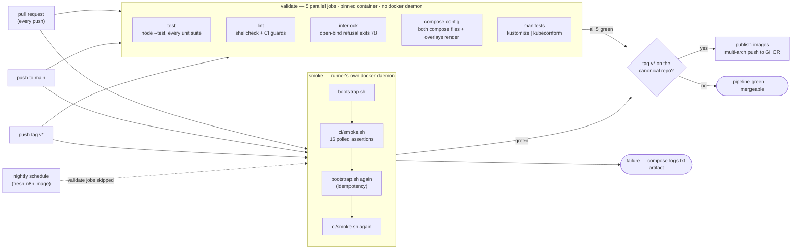

# CI pipeline

CI runs on GitHub Actions, in `.github/workflows/ci.yml`. Five validate jobs and one smoke job run in parallel on every pull request and every push to `main`. The smoke job boots the complete bundled stack twice. A seventh job publishes container images, and it alone waits for all six others. Nightly scheduled builds run only the smoke job against the latest upstream n8n image.



Unlike the GitLab pipeline this replaces, `smoke` does not wait for the validate jobs. That barrier existed to keep a 30-minute bring-up off a scarce self-hosted runner after a two-second lint failure; GitHub-hosted runners are free and unmetered on public repositories, so the wait bought nothing. Chaining them would also break the nightly schedule, because a job whose `needs` were skipped is itself skipped.

Superseded pull request runs are cancelled automatically. Tag runs are never cancelled — they are publishing an immutable image.

## CI Jobs

| Job | Image | Description |
|---|---|---|
| `test` | `node:24-alpine` | Runs all unit test suites (`html/`, `site/`, `lib/`, `server/`, `observability/`) with Node's built-in test runner, under a coverage floor. The report goes to the run summary. |
| `lint` | `shellcheck-alpine:v0.10.0` | Runs ShellCheck on every shell script, then the five `ci/check-*.sh` guards: expired markers in `bootstrap.sh`, the Grafana and dashboard shared entrypoints, the read-only preflight, and duplicate keys in `.env.example`. |
| `interlock` | `alpine:3.20` | Verifies that `bootstrap.sh` exits with code 78 when configured with a non-loopback bind address without authentication. |
| `compose-config` | `docker:27` | Validates both Docker Compose files (bundled and read-only) and their overlays using `docker compose config`. |
| `manifests` | `alpine/k8s:1.31.1` | Validates Kubernetes manifests in `deploy/k8s` against Kubernetes schemas using `kustomize` and `kubeconform -strict`. The schemas are cached between runs, so only a cold cache needs `raw.githubusercontent.com`; the job is capped at 5 minutes because an unreachable schema host otherwise fails slowly. |
| `smoke` | none — the runner host | Starts the full bundled stack on the runner's Docker daemon, verifies 16 HTTP assertions with `ci/smoke.sh`, and runs bootstrap twice to verify idempotency. |
| `publish-images` | none — the runner host | On `v*` tags only, and only on the canonical repository: builds `server/` for `linux/amd64` and `linux/arm64` and pushes it to GHCR. |

The five validate jobs pin their toolchain with a job `container:`, the direct analogue of the per-job `image:` this pipeline used on GitLab. `smoke` and `publish-images` deliberately have no `container:` — a job container cannot reach the host Docker daemon, and requiring one is what forced the old pipeline onto Docker-in-Docker.

You can run all validation jobs locally without starting the docker stack. See [CONTRIBUTING.md](../CONTRIBUTING.md) for local commands.

## Runner policy

Every job runs on a GitHub-hosted `ubuntu-24.04` runner, which ships a working Docker daemon (Server 28.x, Compose v2, Buildx) on a disposable virtual machine. Nothing here needs a privileged host, so there is no Docker-in-Docker service and no runner tag.

Self-hosted runners are deliberately not used. A pull request from a fork executes repository code, and on a public repository that would mean running arbitrary contributed code on our own hardware. GitHub makes the same recommendation.

Because the stack and the job share one machine, `smoke` reaches the published ports over loopback. `BIND_ADDR` therefore stays at `127.0.0.1` and the exposure interlock is fully armed during the smoke run — the Docker-in-Docker pipeline had to bind `0.0.0.0` and set `PO11Y_ALLOW_OPEN_BIND=1` to get past it.

## Published images

`publish-images` runs on `v*` tags after every other job passes, so a published image is by definition a green build. It publishes:

```
ghcr.io/labrise-consulting/po11y/server:<git tag>   (immutable)
ghcr.io/labrise-consulting/po11y/server:latest      (moving alias)
```

Only the `server` process is published. The root `Dockerfile` is never pushed: it derives from n8n's image, which carries the Sustainable Use License. Both compose files build the server from source, so running either topology needs the clone rather than the published image.

Authentication uses the job-scoped `GITHUB_TOKEN` with `packages: write`, so there is no long-lived registry credential to store or rotate. The job is guarded on `github.repository`, which returns the organisation's canonical capitalisation — a lowercase literal in that comparison would never match, and the job would silently skip on a real tag.

## Nightly builds

Scheduled nightly builds run only the `smoke` job. This tests the repository against the newest upstream `n8n` image to detect upstream regressions quickly.

## Test execution details

- Smoke tests set `AI_MAP_BASE_URL` with an empty API key, disabling LLM calls and using deterministic local heuristics.
- Assertions poll for up to 90 seconds (`SMOKE_TIMEOUT`) to prevent false failures from startup delays.
- Failed smoke jobs upload container logs as the `compose-logs` artifact.
